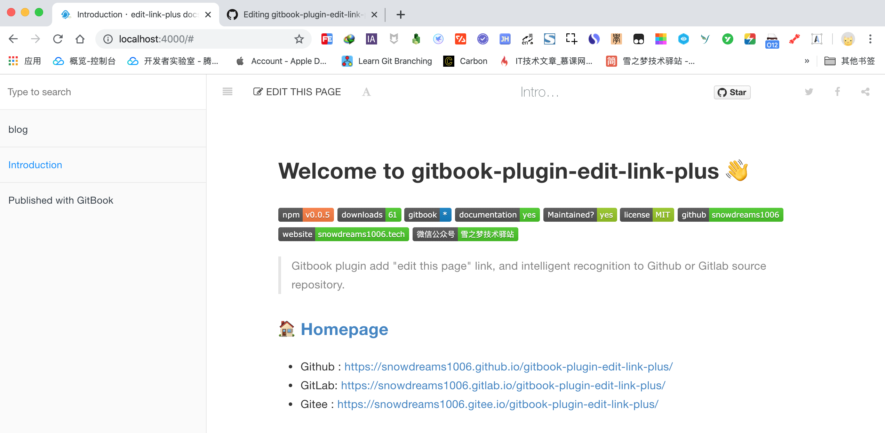

# Welcome to gitbook-plugin-edit-link-plus 👋

[](https://www.npmjs.com/package/gitbook-plugin-edit-link-plus)
[](https://www.npmjs.com/package/gitbook-plugin-edit-link-plus)
[](https://www.npmjs.com/package/gitbook-plugin-edit-link-plus)
[](https://github.com/snowdreams1006/gitbook-plugin-edit-link-plus#readme)
[](https://github.com/snowdreams1006/gitbook-plugin-edit-link-plus/graphs/commit-activity)
[](https://github.com/snowdreams1006/gitbook-plugin-edit-link-plus/blob/master/LICENSE)
[](https://github.com/snowdreams1006)
[](https://snowdreams1006.tech/)
[](https://snowdreams1006.github.io/snowdreams1006-wechat-public.jpeg)

> Gitbook plugin add "edit this page" link, and intelligent recognition to Github or Gitlab source repository.

### 🏠 [Homepage](https://github.com/snowdreams1006/gitbook-plugin-edit-link-plus#readme)

- Github : [https://snowdreams1006.github.io/gitbook-plugin-edit-link-plus/](https://snowdreams1006.github.io/gitbook-plugin-edit-link-plus/)
- GitLab: [https://snowdreams1006.gitlab.io/gitbook-plugin-edit-link-plus/](https://snowdreams1006.gitlab.io/gitbook-plugin-edit-link-plus/)
- Gitee : [https://snowdreams1006.gitee.io/gitbook-plugin-edit-link-plus/](https://snowdreams1006.gitee.io/gitbook-plugin-edit-link-plus/)

## Screenshot



## Usage

### Step #1 - Update `book.json` file

1. In you gitbook's `book.json` file, add `edit-link-plus` to `plugins` list.
2. In `pluginsConfig`, Set `base` value which is base path to your github or gitlab or other code repo. Trailing slash is NOT required.
3. By default link label will be "Edit This Page". You can change it using plugin config `label`.
4. In `pluginsConfig`, Set `defaultBase` value which is set as default base path to your github or gitlab or other code repo. Trailing slash is also NOT required.

Here is simplest example :

```json
{
    "plugins": ["edit-link-plus"],
    "pluginsConfig": {
        "edit-link-plus": {
            "base": "https://github.com/USER/REPO/edit/BRANCH/path/to/book"
        }
    }
}
```

In addition, the supported configuration options are as follows : 

```json
"base": {
  "type": [
    "string",
    "object"
  ],
  "title": "Base for the edit redirection",
  "required": true
},
"defaultBase": {
  "type": "string",
  "title": "Default base for the edit redirection",
  "required": false
},
"label": {
  "type": [
    "string",
    "object"
  ],
  "title": "Label for the edit button",
  "default": "Edit This Page",
  "required": false
}
```

### Step #2 - gitbook commands

1. Run `gitbook install`. It will automatically install `edit-link-plus` gitbook plugin for your book. This is needed only once.

```bash
gitbook install
```

or you can run `npm install gitbook-plugin-edit-link-plus` to install locally.

```bash
npm install gitbook-plugin-edit-link-plus
```

2. Build your book (`gitbook build`) or serve (`gitbook serve`) as usual.

```bash
gitbook serve
```

## Example

- Official documentation configuration file

> [https://github.com/snowdreams1006/gitbook-plugin-edit-link-plus/blob/master/docs/book.json](https://github.com/snowdreams1006/gitbook-plugin-edit-link-plus/blob/master/docs/book.json)

```json
{
    "plugins": ["edit-link-plus"],
    "pluginsConfig": {
        "edit-link-plus": {
            "base": {
              "snowdreams1006.github.io":"https://github.com/snowdreams1006/gitbook-plugin-edit-link-plus/edit/master/docs",
              "snowdreams1006.gitlab.io":"https://gitlab.com/snowdreams1006/gitbook-plugin-edit-link-plus/edit/master/docs",
              "snowdreams1006.gitee.io":"https://gitee.com/snowdreams1006/gitbook-plugin-edit-link-plus/edit/master/docs"
            },
            "defaultBase": "https://github.com/snowdreams1006/gitbook-plugin-edit-link-plus/edit/master/docs",
            "label": "Edit This Page"
        }
    }
}
```

- Official example configuration file

> [https://github.com/snowdreams1006/gitbook-plugin-edit-link-plus/blob/master/example/book.json](https://github.com/snowdreams1006/gitbook-plugin-edit-link-plus/blob/master/example/book.json)

```json
{
    "plugins": ["edit-link-plus"],
    "pluginsConfig": {
        "edit-link-plus": {
            "base": "https://github.com/snowdreams1006/gitbook-plugin-edit-link-plus/edit/master/example"
        }
    }
}
```

### Sample `book.json` file 

```json
{
    "plugins": ["edit-link-plus"],
    "pluginsConfig": {
        "edit-link-plus": {
            "base": "https://github.com/USER/REPO/edit/BRANCH/path/to/book"
        }
    }
}
```

or you can add `label` to custom your label:

```json
{
    "plugins": ["edit-link-plus"],
    "pluginsConfig": {
        "edit-link-plus": {
            "base": "https://github.com/USER/REPO/edit/BRANCH/path/to/book",
            "label": "点我反馈"
        }
    }
}
```

### Sample `book.json` file for Multi-source base

```json
{
    "plugins": ["edit-link-plus"],
    "pluginsConfig": {
        "edit-link-plus": {
            "base": {
              "USER.github.io":"https://github.com/USER/REPO/edit/BRANCH/path/to/book",
              "USER.gitlab.io":"https://gitlab.com/USER/REPO/edit/BRANCH/path/to/book",
              "USER.gitee.io":"https://gitee.com/USER/REPO/edit/BRANCH/path/to/book",
              "CUSTOME DOMAIN":"https://github.com/snowdreams1006/gitbook-plugin-edit-link-plus/edit/master/docs"
            },
            "defaultBase": "https://github.com/USER/REPO/edit/BRANCH/path/to/book",
            "label": "Edit This Page"
        }
    }
}
```

### Sample `book.json` file for multilingual labels

```json
{
    "plugins": ["edit-link-plus"],
    "pluginsConfig": {
        "edit-link-plus": {
            "base": "https://github.com/USER/REPO/edit/BRANCH/path/to/book",
            "label": {
                "en": "Edit This Page",
                "zh": "编辑本页"
            }
        }
    }
}
```

**Note**: Above snippet can be used as complete `book.json` file, if your book doesn't have one yet.

**Github/Gitlab**: In string `...REPO/edit/BRANCH...`, you may replace `edit` with `tree` if you want source file to open in read-mode, rather than edit-mode directly on github/gitlab.

## Author

👤 **snowdreams1006**

- Website: [snowdreams1006.tech](https://snowdreams1006.tech/)
- Github: [@snowdreams1006](https://github.com/snowdreams1006)
- Email: [snowdreams1006@163.com](mailto:snowdreams1006@163.com)

## Contributing

Contributions, issues and feature requests are welcome!<br />Feel free to check [issues page](https://github.com/snowdreams1006/gitbook-plugin-edit-link-plus/issues).

## Show your support

Give a [**Star**](https://github.com/snowdreams1006/gitbook-plugin-edit-link-plus) if this project helped you!

## Copyright

Copyright © 2019 [snowdreams1006](https://github.com/snowdreams1006).

This project is [MIT](https://github.com/snowdreams1006/gitbook-plugin-edit-link-plus/blob/master/LICENSE) licensed.

## Thanks

- [gitbook-plugin-editlink](https://github.com/zhaoda/gitbook-plugin-editlink)
- [gitbook-plugin-edit-link](https://github.com/rtCamp/gitbook-plugin-edit-link)

## Troubleshooting

1. If you are not seeing the "Edit this page" link, check if your `book.json` is valid. You can use this online tool - [http://json.parser.online.fr/beta/](http://json.parser.online.fr/beta/)
2. Check if you are using default gitbook theme. It is NOT recommended to modify gitbook themes directly.